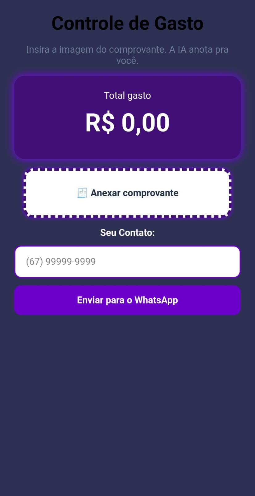

# 💰 Controle de Gastos

**Uma forma simples e rápida de organizar seus gastos através de comprovantes.**

[🌐 Acessar projeto](https://controle-de-gastos-orpin.vercel.app/)

📌 Sobre o projeto

O Controle de Gastos foi criado a partir de uma situação bem comum: depois de fazer várias compras durante o dia, nem sempre é fácil lembrar quanto foi gasto ou organizar todas essas informações manualmente.

A ideia do projeto é tornar esse processo mais simples.

Em vez de precisar digitar cada informação do comprovante, o usuário pode enviar uma foto do comprovante e deixar a aplicação identificar os dados automaticamente.

Além disso, o projeto possui uma opção para enviar as informações para o WhatsApp, deixando o processo mais rápido para quem quer registrar ou compartilhar seus gastos.

Esse projeto também fez parte da minha evolução como desenvolvedor Front-End, principalmente para praticar JavaScript, manipulação de dados, integração entre funcionalidades e criação de uma interface simples e responsiva.

🎯 Objetivo

O principal objetivo foi desenvolver uma aplicação que resolvesse um problema cotidiano de forma simples.

Durante o desenvolvimento, procurei trabalhar principalmente em:

📷 Leitura de informações através de uma imagem
🤖 Integração com inteligência artificial
💰 Organização de informações financeiras
📱 Experiência responsiva para diferentes dispositivos
💬 Integração com WhatsApp
🎨 Criação de uma interface simples e intuitiva
⚡ Redução da quantidade de informações que o usuário precisa digitar manualmente

Mais do que criar apenas uma interface bonita, a intenção foi entender como diferentes funcionalidades podem trabalhar juntas para resolver uma necessidade real.

🚀 Funcionalidades
🧾 Leitura de comprovantes

O usuário pode anexar uma imagem do comprovante e a aplicação utiliza IA para interpretar as informações presentes nele.

💰 Controle dos gastos

As informações identificadas no comprovante são organizadas para facilitar a visualização dos valores gastos.

📊 Visualização do total

O projeto apresenta o total dos gastos de forma simples, permitindo que o usuário tenha uma visão rápida do valor registrado.

📱 Integração com WhatsApp

Após o processamento das informações, o usuário pode informar um número de telefone e enviar os dados diretamente para o WhatsApp.

📱 Interface responsiva

A aplicação foi desenvolvida pensando também na utilização pelo celular, já que esse tipo de ferramenta normalmente é utilizado durante ou logo após uma compra.

🧠 O que aprendi desenvolvendo esse projeto

Esse projeto foi importante para minha evolução porque me tirou um pouco da ideia de desenvolver apenas páginas estáticas.

Durante o desenvolvimento, tive contato com problemas mais próximos de uma aplicação real, como:

manipulação de arquivos e imagens;
tratamento de informações retornadas pela IA;
manipulação do DOM;
validação de informações inseridas pelo usuário;
criação de mensagens formatadas;
integração com WhatsApp;
preocupação com responsividade;
organização do código;
tratamento de possíveis erros durante o uso.

Também percebi que desenvolver uma aplicação não é apenas fazer algo funcionar. É preciso pensar em como uma pessoa realmente vai utilizar aquilo.

🛠️ Tecnologias utilizadas
HTML5
CSS3
JavaScript
Integração com IA

🌐 Projeto online

Você pode testar a aplicação diretamente pelo link abaixo:

[Acessar o Controle de Gastos](https://controle-de-gastos-orpin.vercel.app/)

🔄 Como funciona

O fluxo principal da aplicação foi pensado para ser bem simples:

📷 Usuário envia o comprovante
             ↓
🤖 A aplicação processa a imagem
             ↓
🧠 A IA identifica as informações
             ↓
💰 Os gastos são organizados
             ↓
📱 Usuário pode enviar para o WhatsApp

A ideia é diminuir a quantidade de etapas necessárias para registrar uma compra.

📈 Próximas melhorias

O projeto ainda pode evoluir bastante. Algumas ideias que pretendo explorar futuramente:

Histórico de gastos

Gráficos de despesas

Filtro por período

Categorias automáticas

Exportação dos gastos

Melhorias na leitura dos comprovantes

Armazenamento dos dados

Melhor tratamento de erros

Melhor experiência em dispositivos móveis

👨‍💻 Sobre o desenvolvimento

Este projeto foi desenvolvido como parte dos meus estudos e prática em desenvolvimento Front-End.

A proposta não foi apenas reproduzir uma interface, mas tentar transformar uma ideia em uma aplicação funcional e entender, na prática, como lidar com problemas que aparecem durante o desenvolvimento.

Foi também uma oportunidade para experimentar novas tecnologias e entender melhor como uma aplicação pode utilizar inteligência artificial para automatizar tarefas que normalmente seriam feitas manualmente.

⭐ Considerações

Esse projeto representa uma etapa da minha evolução como desenvolvedor.

Ainda existem várias coisas que podem ser melhoradas, mas justamente por isso pretendo continuar evoluindo a aplicação conforme avanço nos meus estudos e adquiro mais experiência.

Se você tiver alguma sugestão ou encontrar algum problema, fique à vontade para abrir uma Issue ou entrar em contato.

Desenvolvido por Ronald Weigan 💻

Front-End Developer | HTML • CSS • JavaScript